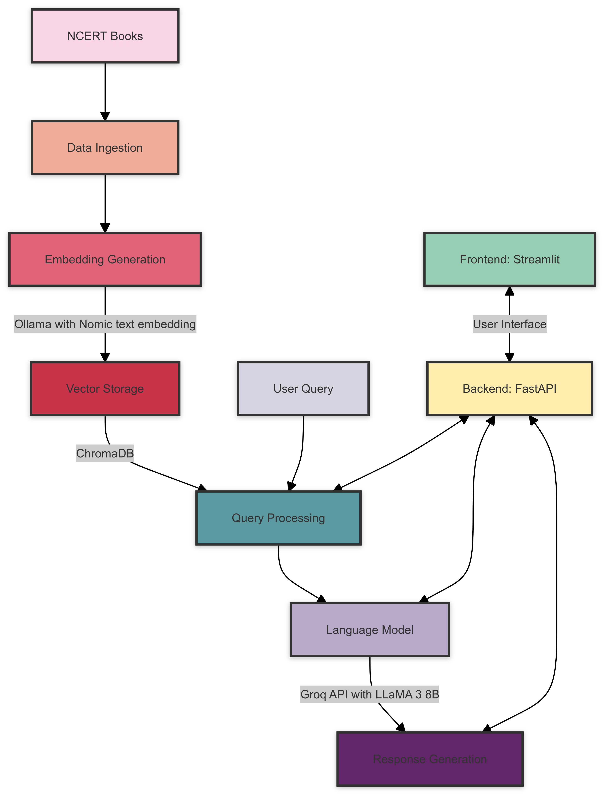

# NCERT Books RAG System

This project implements a Retrieval-Augmented Generation (RAG) system for NCERT books using Ollama for text embedding and vector database, and Groq API for the language model response.

## Features

- Uses Nomic text embedding model via Ollama for creating vector embeddings
- Stores embeddings in ChromaDB
- Utilizes Groq API with LLaMA 3 8B model for generating responses
- Provides a FastAPI backend and Streamlit frontend for user interaction

## Streamlit Interface

Below is a screenshot of the Streamlit interface for our NCERT Books RAG system:


## System Architecture

Here's an overview of the NCERT Books RAG system architecture:




The system architecture consists of the following components:

1. **Data Ingestion**: NCERT books are processed and prepared for embedding.
2. **Embedding Generation**: Ollama with the Nomic text embedding model creates vector embeddings for the processed text.
3. **Vector Storage**: ChromaDB stores the generated embeddings for efficient retrieval.
4. **Query Processing**: User queries are processed and relevant embeddings are retrieved from ChromaDB.
5. **Language Model**: Groq API with LLaMA 3 8B model generates responses based on the retrieved context and user query.
6. **Backend**: FastAPI handles the communication between the frontend and the various system components.
7. **Frontend**: Streamlit provides an interactive user interface for querying the system and displaying results.

## Prerequisites

Before you begin, ensure you have met the following requirements:

- Python 3.7+
- Ollama installed and set up
- Groq API account and API key

## Installation

1. Clone the repository:
   ```
   git clone https://github.com/yourusername/ncert-rag-system.git
   cd ncert-rag-system
   ```

2. Install the required dependencies:
   ```
   pip install -r requirements.txt
   ```

3. Download and set up Ollama:
   - Follow the instructions at [Ollama's official website](https://ollama.ai) to install Ollama
   - Download the Nomic text embedding model:
     ```
     ollama pull nomic-embed-text
     ```

4. Set up your Groq API key:
   - Create a `.env` file in the project root
   - Add your Groq API key:
     ```
     GROQ_API_KEY=your_api_key_here
     ```

## Usage

1. Start the FastAPI backend:
   ```
   uvicorn main:app --reload
   ```

2. Launch the Streamlit UI:
   ```
   streamlit run streamlit_app.py
   ```

3. Open your web browser and navigate to the Streamlit app URL (typically `http://localhost:8501`)

4. Use the interface to interact with the NCERT books RAG system

## RAG Evaluation


## License

This project is licensed under the MIT License - see the [LICENSE](LICENSE) file for details.

## Contributing

Contributions are welcome! Please feel free to submit a Pull Request.

## Acknowledgements

- [Ollama](https://ollama.ai) for providing the embedding model
- [Groq](https://groq.com) for their LLM API
- [FastAPI](https://fastapi.tiangolo.com) and [Streamlit](https://streamlit.io) for the backend and frontend frameworks
